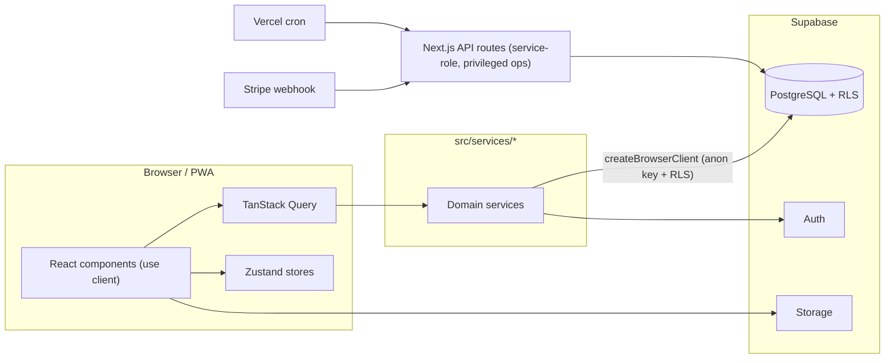

# TrainHub

> Multi-tenant SaaS platform for personal trainers: client management, workout &
> nutrition builders, progress tracking, in-app messaging and Stripe subscriptions.
> Built with Next.js 14 (App Router) and Supabase, dark-first PWA, bilingual (ES/EN).

[](https://github.com/FernandoRoyano/TrainHub/actions/workflows/ci.yml)


**Live:** [train-hub-five.vercel.app](https://train-hub-five.vercel.app)

---

## Why this project exists

Personal trainers juggle spreadsheets, WhatsApp and payment apps. TrainHub unifies the
workflow into one product: the trainer builds routines and meal plans, assigns them to
clients, tracks real activity and gets paid — while each client gets a focused mobile-first
app for their plan. It handles **health data** (measurements, injuries, menstrual cycle),
so GDPR compliance and a hard security boundary were first-class requirements, not
afterthoughts.

This repository is also a study in **engineering judgement**: the interesting parts are the
decisions and their tradeoffs, documented as [ADRs](docs/adr/) and an honest
[production-readiness assessment](docs/PRODUCTION-READINESS.md).

## Stack

| Layer | Choice | Notes |
|---|---|---|
| Framework | Next.js 14 (App Router) | Client-side data layer, PWA |
| Language | TypeScript 5 (strict) | |
| DB / Auth / Storage | Supabase (PostgreSQL) | **Row-Level Security is the security boundary** |
| Server state | TanStack Query 5 | Per-domain cache policy ([config](src/lib/query-config.ts)) |
| Client state | Zustand 5 | Routine / nutrition builders |
| Validation | Zod 4 | Shared client + server schemas |
| Payments | Stripe 20 (Subscriptions) | Multi-currency (EUR/USD/MXN) |
| i18n | next-intl 4 | ES / EN |
| Styling | Tailwind 3 + design tokens | Dark-first, [design system](skills/design-system.md) |
| Charts / DnD | Recharts 3 · dnd-kit | |
| Email | Nodemailer (Gmail SMTP) | Invitations |
| Testing | Vitest (490 unit) · Playwright (E2E) | + a load-test harness |
| Deploy | Vercel + Supabase | Cron via Vercel |

## Architecture at a glance



Full write-up (data model, security model, caching strategy): **[docs/ARCHITECTURE.md](docs/ARCHITECTURE.md)**.

## Getting started

```bash
# 1. Install
npm install

# 2. Configure env (see table below)
cp .env.local.example .env.local   # then fill in the values

# 3. Run
npm run dev                        # http://localhost:3000
```

### Required environment variables

| Variable | Purpose |
|---|---|
| `NEXT_PUBLIC_SUPABASE_URL` / `NEXT_PUBLIC_SUPABASE_ANON_KEY` | Supabase client (RLS-scoped) |
| `SUPABASE_SERVICE_ROLE_KEY` | Server-only, privileged API routes |
| `STRIPE_SECRET_KEY` / `NEXT_PUBLIC_STRIPE_PUBLISHABLE_KEY` / `STRIPE_WEBHOOK_SECRET` | Payments |
| `STRIPE_PRICE_*` | Price IDs per plan/interval |
| `GMAIL_USER` / `GMAIL_APP_PASSWORD` | Invitation email (SMTP) |
| `USDA_API_KEY` / `SPOONACULAR` / `YOUTUBE` | External food & video search |
| `CRON_SECRET` | Guards the daily cron endpoint |
| `NEXT_PUBLIC_ENABLE_PAYMENTS` | Feature flag for Stripe UI |

> Never commit `.env.local`. Service-role key and Stripe secret are **server-only** and must
> never reach the browser bundle.

## Scripts

```bash
npm run dev        # dev server (turbo)
npm run build      # production build
npm run lint       # ESLint
npm run test       # Vitest (unit)
npm run test:e2e   # Playwright (E2E)
```

## Testing

- **490 unit tests** across 48 suites (services, validation, RLS logic, i18n completeness).
- **E2E** with Playwright (auth, routine assignment, workout flow, invite flow…).
- **Load-test harness** used to size capacity and validate query patterns under real
  concurrency — see [ADR-0002](docs/adr/0002-flat-queries-over-nested-embeds.md).

## Database & migrations

Schema lives in [`supabase/migrations/`](supabase/migrations/) (50 versioned SQL files).
The migration workflow and its known limitation are documented in
[docs/PRODUCTION-READINESS.md](docs/PRODUCTION-READINESS.md).

## Documentation map

- [docs/ARCHITECTURE.md](docs/ARCHITECTURE.md) — system, data model, security & caching.
- [docs/adr/](docs/adr/) — Architecture Decision Records (the *why* behind key choices).
- [docs/PRODUCTION-READINESS.md](docs/PRODUCTION-READINESS.md) — honest gap analysis with a
  remediation plan (traffic-light: what's solid, what's a risk, what blocks a paying customer).

---

<sub>Solo-built product. Docs are written in English (engineering lingua franca); in-code
business comments are in Spanish, matching the team context this was built for.</sub>
