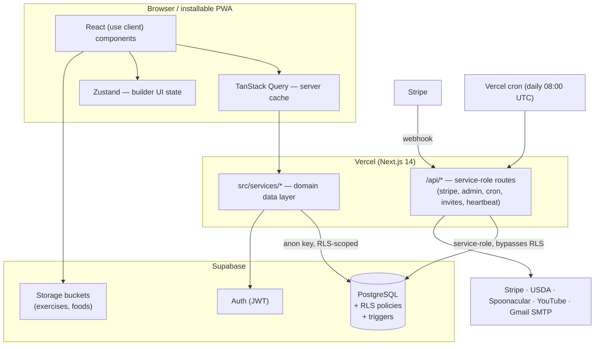
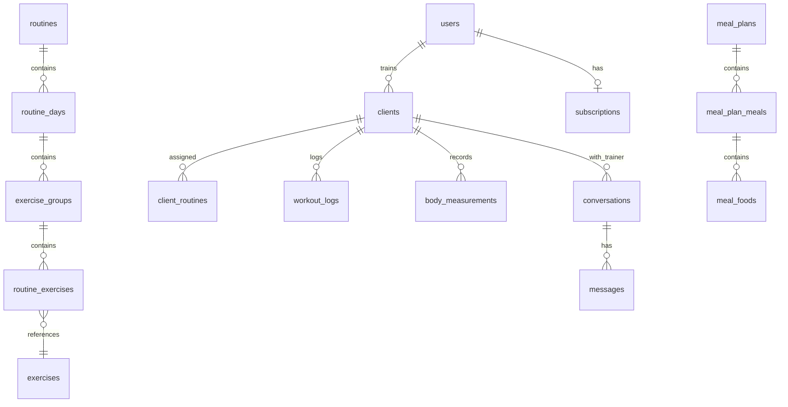

# Architecture

This document explains **how TrainHub is built and why**. For the reasoning behind specific
choices, see the [ADRs](adr/); for the honest state of production-readiness, see
[PRODUCTION-READINESS.md](PRODUCTION-READINESS.md).

## 1. System overview

TrainHub is a **client-heavy Next.js App Router application** talking directly to Supabase
under Row-Level Security, with a thin set of privileged server routes for operations that
must not run with the user's own permissions (Stripe, admin, cron, invitations).



**Key idea:** the browser holds an RLS-scoped Supabase client (anon key + user JWT). Every
read/write is authorised by Postgres policies, so the frontend is *not* a trusted boundary —
it is just a convenient place to run queries. Anything that must exceed the user's rights
goes through an `/api/*` route using the service-role key on the server only.

## 2. Layers

| Layer | Location | Responsibility |
|---|---|---|
| Components | `src/app/**`, `src/components/**` | UI, all `"use client"`; route groups `(trainer)`, `(client)`, `(admin)`, `(auth)` |
| Hooks | `src/hooks/**` | React Query wrappers, per-domain cache config |
| Services | `src/services/**` | The data layer: every Supabase query lives here (24 services) |
| Stores | `src/stores/**` | Zustand — routine & nutrition builder working state |
| Validation | `src/lib/validations/**` | Zod schemas shared by forms and API routes |
| Server routes | `src/app/api/**` | Privileged operations (service-role) |
| DB | `supabase/migrations/**` | Schema, RLS policies, triggers, RPCs (50 migrations) |

Data flow for a typical read:

```
component → useQuery hook → service.getX() → supabase.from(...).select() [RLS] → Postgres
```

## 3. Data model (core tables)



- `users` mirrors `auth.users` (role: `admin | trainer | client`), created by a trigger on
  sign-up.
- A **trainer** owns `clients`, `routines`, `exercises`, `meal_plans`, `exercise_blocks`.
- A **client** row optionally links to an `auth.users` account (`user_id`) once they accept
  an invitation; the client app is gated on that link.
- Workout structure is 3 levels deep: `routine_days → exercise_groups → routine_exercises`,
  supporting supersets/trisets/circuits/EMOM/AMRAP.

## 4. Security model — RLS as the boundary

Every table has RLS enabled. Two dominant policy shapes:

- **Owner check** (fast, indexable): `auth.uid() = trainer_id` on trainer-owned tables.
- **Membership check** (client-facing child tables):
  `EXISTS (SELECT 1 FROM clients WHERE clients.id = X.client_id AND clients.user_id = auth.uid())`.

Design consequences that shaped the codebase:

1. **`clients(user_id)` is the hottest index** — it's the right-hand side of ~20 policies.
   Adding it was the single highest-impact DB change ([migration 00041](../supabase/migrations/00041_performance_indexes.sql)).
2. **`auth.uid()` is wrapped as `(select auth.uid())`** in policies so Postgres evaluates it
   once per statement (initplan) instead of once per row — see [ADR-0007](adr/0007-rls-initplan-optimization.md).
3. **Business rules are enforced in the database, not just the UI.** The client-limit cap
   lives in a `BEFORE INSERT` trigger (`enforce_client_limit`) *and* in the subscription hook —
   defense in depth, [ADR-0003](adr/0003-defense-in-depth-business-rules.md).
4. **Policy drift is a real risk** with a dashboard-editable database: an audit found policies
   living only in the DB, not in the repo migrations — reconciled in
   [migration 00045](../supabase/migrations/00045_dashboard_policies.sql).

## 5. Caching & performance

Because all data is fetched client-side, the caching strategy is **TanStack Query policy per
domain** ([`src/lib/query-config.ts`](../src/lib/query-config.ts)) plus **query shape
discipline**:

- Static-ish catalogs (exercises, foods) cached 24h with `keepPreviousData`.
- Dashboard aggregates collapsed from **15 round-trips into 1 `SECURITY INVOKER` RPC**
  (`get_dashboard_stats`) — measured p50 ~500ms → ~162ms.
- Reads that fan out use **flat batched queries with `.in()`**, *not* nested PostgREST
  embeds. This was a decision reversed by a load test that showed nested embeds + RLS
  collapsing under concurrency (100% statement timeouts) — [ADR-0002](adr/0002-flat-queries-over-nested-embeds.md).
- Real client activity is tracked with a throttled **heartbeat** rather than
  `auth.last_sign_in_at`, which is stale for a persistent-session PWA — [ADR-0005](adr/0005-heartbeat-last-active.md).

Measured capacity (load test, shared free-tier instance): comfortable at ~40 concurrent
active users, i.e. ~2 orders of magnitude above current usage; the scaling lever is Supabase
compute, not more SQL.

## 6. Payments

Stripe Subscriptions with a webhook (`/api/stripe/webhook`) that is **idempotent** (unique
constraint on `stripe_events`, atomic insert with 23505 detection). Tier is derived from the
price ID so a plan change via the Billing Portal can't desync. Prices carry
`currency_options` for **EUR / USD / MXN** so Checkout shows the buyer's local currency while
settlement stays in EUR — [ADR-0004](adr/0004-multi-currency-currency-options.md).

## 7. Internationalisation, PWA, offline

- `next-intl` with ES/EN message catalogs; an i18n-completeness test fails the build if a key
  is missing in either locale.
- Installable PWA (`manifest.ts`, service worker) with an offline page; dark-first theme via
  `next-themes` and a token-based design system ([skills/design-system.md](../skills/design-system.md)).

## 8. External integrations

| Service | Use | Caching |
|---|---|---|
| Stripe | Subscriptions, Billing Portal, webhook | — |
| USDA / Spoonacular | Food nutrition & photos | `next.revalidate` 1h/24h |
| YouTube | Exercise video search | `next.revalidate` 7d |
| Gmail SMTP | Client invitations | — |
| Cloudflare Turnstile | Anti-bot on signup | — |
